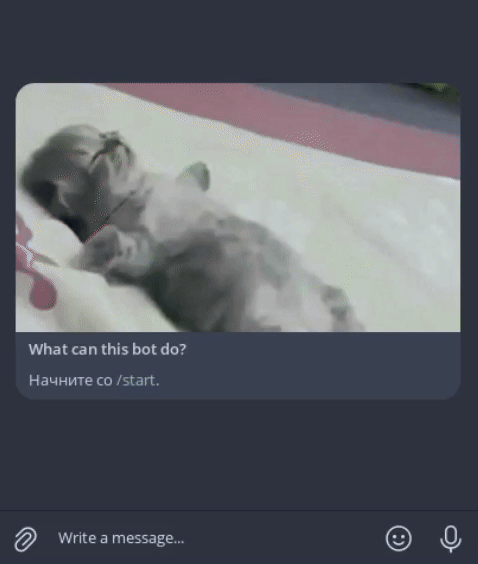

# Крутой бизнес-бот

## Описание

Это чат-бот, предназначенный для оптимизации бизнес-процесса.
Рассматриваемый бизнес процесс &mdash; заказ клиентом определенного товара за цену, предлагаемую самим клиентом.

[!WARNING]
Данный проект не рассчитан на реальное использование, но это и так понятно, думаю.

## Запуск на локальной машине

Требования: `python>=3.10`

1. Клонируйте репозиторий:  
```console
$ git clone https://github.com/maxxeddd/tg-bot.git
```

2. Перейдите в директорию:
```console
$ cd tg-bot
```

3. Установите зависимости:
```console
pip install -r requirements.txt
```

4. Создайте файл `.env` в директории со следующем содержанием: 
```
TOKEN=ТОКЕН_БОТА
MANAGER_CHAT_ID=ID_МЕНЕДЖЕРА
```
где ТОКЕН_БОТА &mdash; токен Вашего бота; ID_МЕНЕДЖЕРА &mdash; ID чата с менеджером. Затем добавьте в массив `managers` username менеджеров. 
   
1. Запустите проект:
```console
python main.py
```

## Функционал
Скажем, существует определённый интернет-магазин-аукцион, и в нём продаются разные товары. Цены у товаров нет, поэтому клиенты предлагают цену сами.  
После предложения цены этот заказ передаётся менеджеру в личные сообщения, и менеджер решает, что делать с этим заказом: одобрить или предложить цену повыше.  
После решения менеджера заказ уходит обратно клиенту, и клиент уже может окончательно подтвердить заказ (либо не подтверждать).

## Демонстрация работы



## Заключение
Код **конечно же** можно улучшить, оптимизировать, и т.д. но в целом бот и так хорошо работает, поэтому по моему мнению код в изменении не нуждается.

Присутствует ошибка при наборе менеджером лишь имени клиента, но это даже не нужно чинить, так как менеджеры сами должны знать как правильно пользоваться ботом.

## Даже не знаю как назвать этот модуль
[maxxeddd](https://github.com/maxxeddd) &mdash; Мой профиль на GitHub!  
[python-telegram-bot](https://github.com/python-telegram-bot/python-telegram-bot) &mdash; Библиотека для написания Телеграм-бота, которую я использовал.  
[Telegram](https://telegram.org/) &mdash; Телеграм. Связан с проектом, без него негде было бы создавать этого чудесного полезного бота.